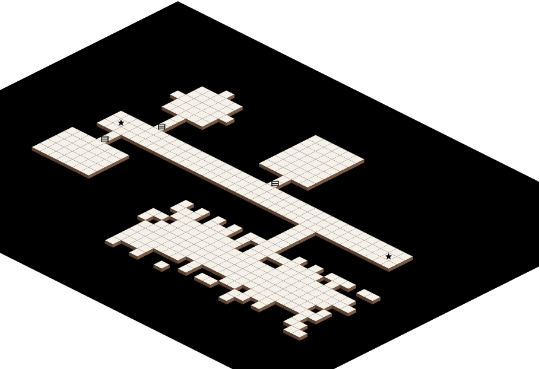

# Map Draw 3

A browser-based dungeon map editor for creating tabletop RPG battle maps. Draw floors, place stamps (doors, traps, stairs), toggle 3D effects, and export high-resolution PNG maps.



## Features

- **Draw & Paint**: Brush tool with adjustable size for painting floors and walls
- **Rough Mode**: Three-click cave generation with noise-based edge deformation
- **Stamps**: Place doors, traps, stars, stairs, and bars on the map grid
- **3D Effect**: Toggle extruded side faces for a 3D appearance
- **Isometric View**: Preview maps in isometric projection
- **Undo/Redo**: Full history support for all edits
- **Save/Load**: Export and import maps as JSON files
- **High-Res Export**: Generate 300dpi PNG output

## Releases

No install required — two ways to use it:

- **Live in browser**: [seelytaylor1.github.io/map-draw-3](https://seelytaylor1.github.io/map-draw-3/) — always the latest build
- **Download**: grab `index.html` from the [latest release](../../releases/latest) and open it locally in any browser

## Requirements

- **Node.js** 16+ and **npm** 7+

## Installation

1. Clone the repository:
   ```bash
   git clone https://github.com/seelytaylor1/map-draw-3.git
   cd map-draw-3
   ```

2. Install dependencies:
   ```bash
   npm install
   ```

## Running the App

### Development Mode
Start the dev server with hot reload:
```bash
npm run dev
```

The app will open at `http://localhost:5173` (or another port if 5173 is busy).

### Build for Production
```bash
npm run build
```

Outputs a single self-contained `dist/index.html` with all assets inlined — open it directly in any browser, no server needed.

### Preview Production Build
```bash
npm run preview
```

## Running Tests

```bash
npm test
```

Runs the Vitest suite for unit tests.

## Technologies

- **React** 19 with TypeScript
- **Vite** for fast development and optimized builds
- **Konva** for canvas rendering
- **react-konva** for React integration with Konva
- **Vitest** for unit testing
- **Playwright** for E2E testing

## Project Structure

- `src/` — Application source code
  - `App.tsx` — Main component
  - `grid.ts` — Tile grid logic
  - `stamps.ts` — Stamp placement and rendering
  - `iso.ts` — Isometric projection
  - `exportShapes.ts` — PNG export
  - `serialization.ts` — Save/load functionality
  - `history.ts` — Undo/redo implementation
- `docs/` — Design specs and planning
- `index.html` — Entry point
- `vite.config.ts` — Vite configuration
