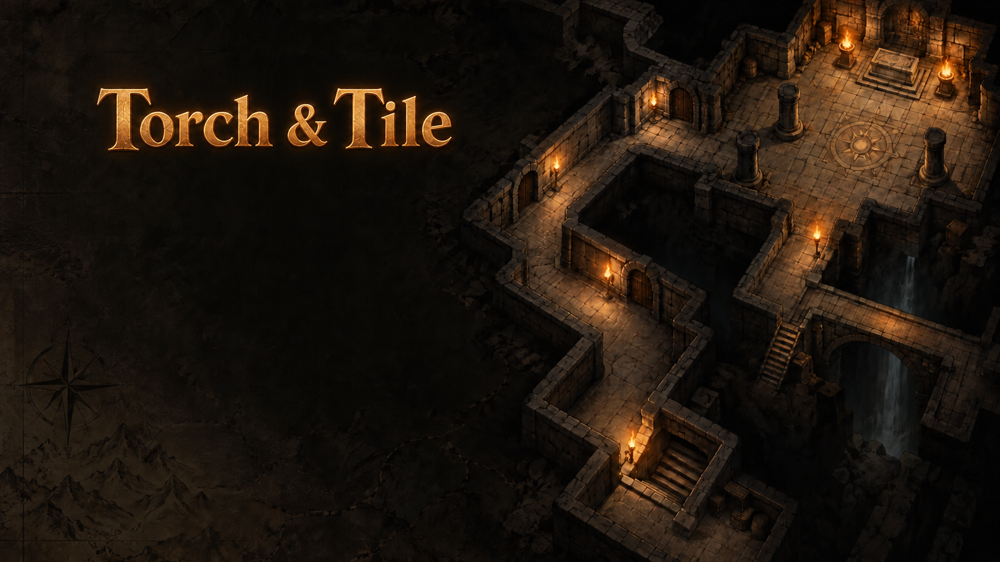
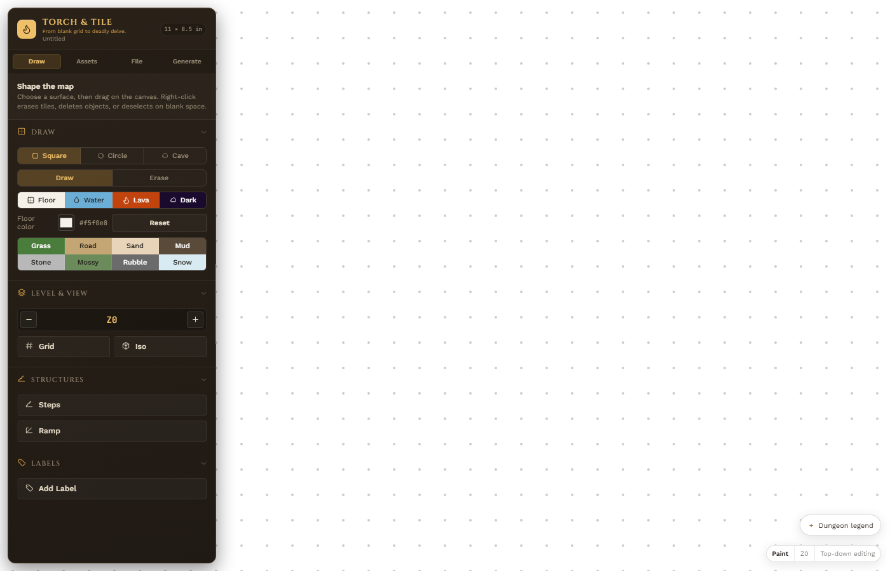

# Torch & Tile

*From blank grid to deadly delve.*

Torch & Tile is a modern dungeon map studio for Shadowdark RPG adventures. Start from a hand-drawn map, or generate a seeded mission-first dungeon with rooms, routes, loops, challenges, entrances, and goals, then refine it with the editor.





## Use It

- **Live in browser**: [seelytaylor1.github.io/map-draw-3](https://seelytaylor1.github.io/map-draw-3/) — always the latest build
- **Desktop app**: download the installer for your platform from the [latest release](../../releases/latest)
  - Windows: `.msi` or `.exe`
  - macOS: `.dmg`
  - Linux: `.AppImage` or `.deb`
- **Standalone HTML**: grab `index.html` from the release and open it in any browser — no install needed

## Features

- **Dungeon generation**: Choose Spine, Hub, or Branches; tune complexity, seed, loops, and challenges; then review capacity before replacing the canvas.
- **Draw & paint**: Use square or circle brushes for floors, water, lava, darkness, and erasing. Environment painting includes grass, road, sand, mud, stone, mossy stone, and rubble with custom colors.
- **Caves and structures**: Create rough caves with a three-click workflow, work across Z-levels, and place ascending or descending stairs and ramps.
- **Assets and annotations**: Search 88 map icons and 137 object assets, then place, move, rotate, mirror, recolor, and scale them. Add numbered or named labels to the map.
- **Views and styling**: Toggle grid and isometric preview, add 3D side faces, configure hatching and clean or rough wall outlines, and tune wall, water, lava, and darkness colors.
- **History and files**: Undo and redo edits, save and load JSON maps, resize the canvas from 1/2-inch to 1/8-inch squares, and export 300 DPI PNG maps.

## Asset Attribution

- Iso objects are from [isometric-map-icons](https://gitlab.com/bindrpg/isometric-map-icons) and are licensed under the [Creative Commons Attribution-ShareAlike 4.0 International License](https://creativecommons.org/licenses/by-sa/4.0/).
- Icon assets are released under [CC0](https://creativecommons.org/publicdomain/zero/1.0/). Feel free to attribute them as created by Mark Gosbell.

## Development

**Requirements**: Node.js 16+ and npm 7+

```bash
git clone https://github.com/seelytaylor1/map-draw-3.git
cd map-draw-3
npm install
npm run dev        # dev server at http://localhost:5173
npm run build      # single self-contained dist/index.html
npm test           # Vitest unit tests
```

For repeatable iso-view performance measurements, start the dev server and run:

```bash
npm run dev
npm run diagnose:iso
```

The diagnostic drives deterministic 1/5/10/20-level fixtures in a browser and
prints JSON for cached and uncached render paths. Set `ISO_DIAGNOSTIC_URL` to
measure another local server.

## About Me
I'm Taylor, and I write adventures and supplements for Shadowdark RPG. https://www.drivethrurpg.com/en/publisher/16706/taylor-seely-wright
